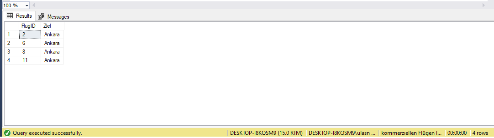
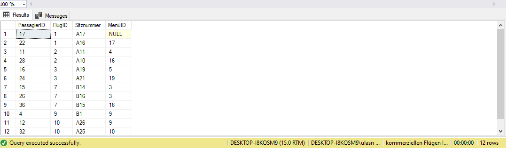
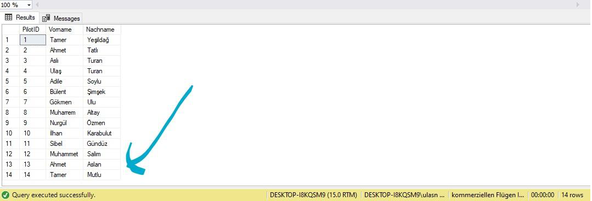
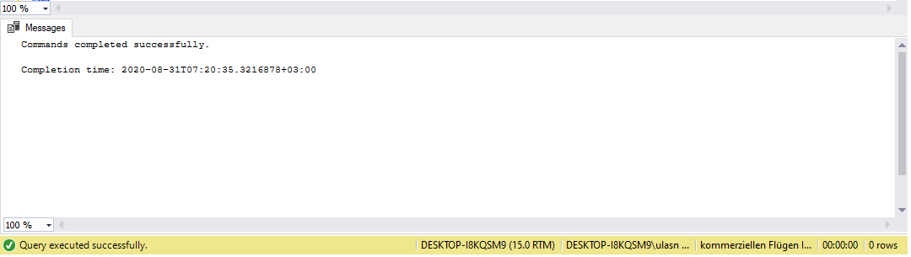
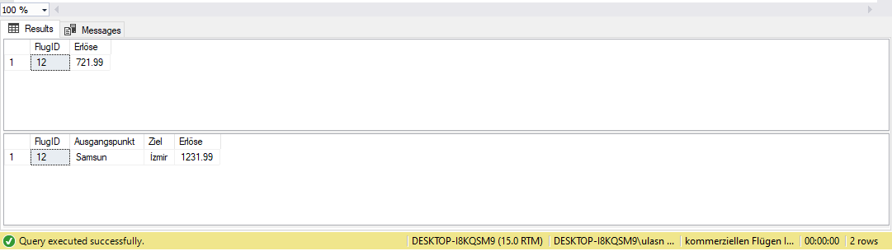
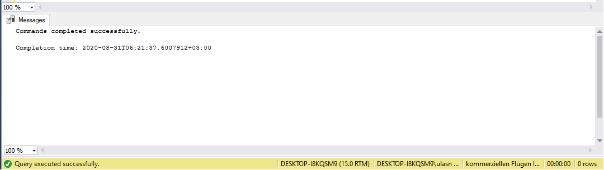
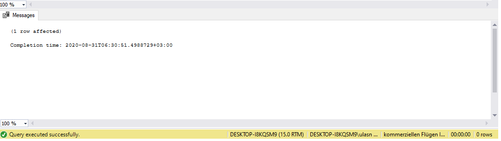

# Database of commercial flights in Turkey with MS SQL Server
The database I created in the introduction to databases course shows the records of commercial flights in Turkey.
    
  >Multiple triggers and stored procedures that I have developed form an important part of the
  >database.


                         **IMPORTANT NOTE: The language of the content of this repo is german!!**


# What did I do with this database?  
 ## _Total of 25 Select queries_
- 5 Join (Inner Join - Right Join-Where - Left Join-Where - Left Join - Right Join)
- 1 Exists, 1 In, 1 Union, 1 Union All, 2 Intersect, 2 Except, 1 Count-Group By, 1 Having-Group By
- 1 Sum-Group By, 1 Avg-Group By, 1 Max-Group By, 1 Min-Group By, 1 Not Exists  

 **For example: (Query with the names of the companies that operate the flights. (Left join) )**

``` sql
SELECT FLÜGE.Ausgangspunkt,Ziel,FLUGGESELLSCHAFTEN.Fg_Name FROM FLÜGE 
LEFT JOIN FLUGGESELLSCHAFTEN ON FLUGGESELLSCHAFTEN.FgID = FLÜGE.FgID
```
 ## _5 Insert, 5 Update, 2 Delete_
 
 **For example: Insert** 

``` sql
INSERT INTO PASSAGIERE(Vorname,Nachname)
SELECT Vorname,Nachname FROM PILOTEN WHERE Vorname='Gökmen'
```
 **For example: Update** 

``` sql
UPDATE PASSAGIER_FLUG SET Sitznummer='D27' WHERE PassagierID='29' AND FlugID='3'
```
 **For example: Delete** 

``` sql
DELETE FROM PASSAGIERE WHERE AdresseID='13' AND Gepäck_Kilo > 15
```
 ## _11 Create, 5 Alter and 2 Drop_
 **For example: Create** 

``` sql
CREATE TABLE PASSAGIERE(
PassagierID int IDENTITY(1,1) NOT NULL,
Vorname nvarchar(50) NOT NULL,
Nachname nvarchar(50) NOT NULL,
Telefon nvarchar(14) NULL,
Email nvarchar(100) NULL,
Geschlecht char(1) NULL,
Details nvarchar(100) NULL,
Gepäck_Kilo numeric(4, 2) NULL,
AdresseID smallint NULL,
PRIMARY KEY (PassagierID),
CONSTRAINT fk_PASSAGIERE_AdresseID FOREIGN KEY (AdresseID)
REFERENCES ADRESSEN(AdresseID)
```

``` sql
CREATE TABLE ADRESSEN(
AdresseID smallint IDENTITY(1,1) NOT NULL,
StadtID smallint NOT NULL,
Postleitzahl nvarchar(5) NOT NULL,
PRIMARY KEY (AdresseID)
CONSTRAINT fk_ADRESSEN_StadtID FOREIGN KEY (StadtID)
REFERENCES STÄDTE(StadtID)
)
```

``` sql
CREATE TABLE PASSAGIER_FLUG(
PassagierID int NOT NULL,
FlugID int NOT NULL,
Betrag numeric(6, 2) NOT NULL,
Sitznummer nvarchar(5) NOT NULL,
KlasseID tinyint NOT NULL,
MenüID tinyint NULL,
PRIMARY KEY (PassagierID,FlugID),
CONSTRAINT fk_PASSAGIER_FLUG_PassagierID FOREIGN KEY (PassagierID) REFERENCES PASSAGIERE(PassagierID),
CONSTRAINT fk_PASSAGIER_FLUG_FlugID FOREIGN KEY (FlugID) REFERENCES FLÜGE(FlugID),
CONSTRAINT fk_PASSAGIER_FLUG_KlasseID FOREIGN KEY (KlasseID) REFERENCES KLASSEN(KlasseID),
CONSTRAINT fk_PASSAGIER_FLUG_MenüID FOREIGN KEY (MenüID) REFERENCES MENÜS(MenüID)
)
```
 **For example: Alter**
``` sql
ALTER TABLE FLÜGE ADD CONSTRAINT fk_FLÜGE_PilotID FOREIGN KEY (PilotId) REFERENCES PILOTEN (PilotId)
```
``` sql
ALTER VIEW [Passagiere, die in der Business Klasse fliegen] AS
SELECT PassagierID,FlugID,Sitznummer FROM PASSAGIER_FLUG
WHERE KlasseID='1'
```
 **For example: Drop**
``` sql
DROP VIEW [Gesamtgepäckgewicht nach Geschlecht]
```
 ## _5 View_
 **For example: View**
``` sql
CREATE VIEW [Flüge Nach Ankara] AS
SELECT FlugID,Ziel FROM FLÜGE
WHERE Ziel='Ankara'
```
``` sql
SELECT * FROM [Flüge Nach Ankara]
```
<p align="center"></p>

``` sql
CREATE VIEW [Flüge Nach Ankara] AS
SELECT FlugID,Ziel FROM FLÜGE
WHERE Ziel='Ankara'
```
``` sql
SELECT * FROM [Gesamtgepäckgewicht nach Geschlecht]
```
<p align="center"></p>

 ## _2 Index_
 **For example: Index**
``` sql
CREATE UNIQUE INDEX PASSA_Telefon
ON PASSAGIERE (Telefon)
``` 
 ## _2 Transactions_
 **For example: Transaction**
``` sql
BEGIN TRANSACTION
DELETE FROM PILOTEN WHERE Nachname='Şen'
SAVE TRANSACTION ZuersteLöschung
DELETE FROM PILOTEN WHERE Vorname='Haluk'
SAVE TRANSACTION ZweiteLöschung
DELETE FROM PILOTEN WHERE Nachname='Aslan'
ROLLBACK TRANSACTION ZweiteLöschung
``` 
``` sql
SELECT * FROM PILOTEN
```
<p align="center"></p>
 
 ## _1 Trigger and 1 Stored Procedure_
 **For example: Trigger**
``` sql
CREATE TRIGGER Aktuell_FlugErlöse
ON PASSAGIER_FLUG
AFTER INSERT
AS
BEGIN
DECLARE @flugid int
DECLARE @betrag numeric(6,2)
SELECT @flugid=FlugID, @betrag=Betrag FROM inserted
SELECT FlugID,Erlöse FROM FLÜGE WHERE FlugID=@flugid
UPDATE FLÜGE
SET Erlöse=Erlöse+ @betrag
WHERE FlugID=@flugid
SELECT FlugID,Ausgangspunkt,Ziel,Erlöse FROM FLÜGE
WHERE FlugID=@flugid
END
```
<p align="center"></p>

``` sql
INSERT INTO PASSAGIER_FLUG(PassagierID,FlugID,Betrag,Sitznummer,KlasseID,MenüID)
VALUES (19,12,510,'B9',3,18)
```
<p align="center"></p>

 **For example: Stored Procedure**
``` sql
CREATE PROCEDURE NeuerPassagier (
@vorname nvarchar(50),
@nachname nvarchar(50),
@telefon nvarchar(14),
@email nvarchar(100),
@geschlecht char(1),
@details nvarchar(100),
@gepäck_kilo numeric(4,2),
@adresseid smallint
)
AS
BEGIN
INSERT INTO PASSAGIERE (Vorname,Nachname,Telefon,Email,
Geschlecht,Details,Gepäck_Kilo,AdresseID)
VALUES(@vorname,@nachname,@telefon,@email,@geschlecht,@details,@gepäck_kilo,@adresseid)
END
```
<p align="center"></p>

``` sql
EXEC NeuerPassagier 'Yeşim','Çimen','05317469558','yesimci@gmail.com','F','NULL','0',2
```
<p align="center"></p>

 


                       
